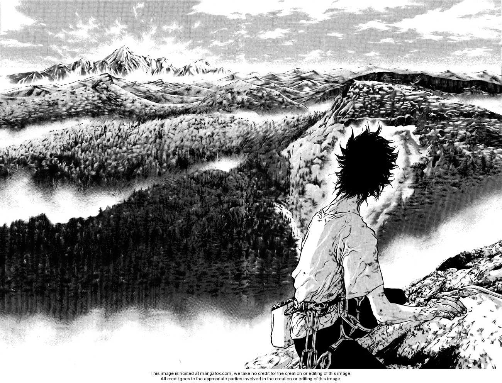

---
  tags:
    - climbing
---
Alright first things first, as of right now I've been climbing at most three times. 

But truth be it got a hold on me, why? Well I think maybe because of how it represent freedom.\
Since I remember I wanted to live unconstrained, not in the *abolish-morality-Nietzche-way*, but in the *not-constrained-by-money-and-societal-norms* way. Moving along the *z-axis* is one of the most badass ways to feel your physical freedom while at the same time interacting with nature, overcoming your fears and shortcomings.

Even though I really haven't been in *any* high mountains, the mere sight or talk of them puts me in awe. I feel they allow for quality contemplations in solitude, escaping the rush and external pressure.

Or the other possibility is simply that If I weren't a human I would want to be a monkey and I read *Kokou no Hito* quite recently.

