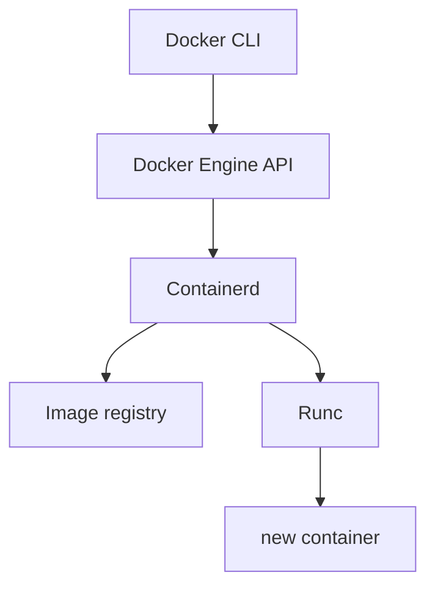

## Simply
Docker is a platform that simplifies [container](../../Resources/Infrastructure/Containers.md) usage by giving us **Docker engine** which handles networking and volumes and delegates container management to [containerd](../../Resources/Infrastructure/Containerd.md)

Docker Engine = Client + Server

Client: The docker CLI (or any API client) that sends requests. \
Server: The daemon process dockerd, which exposes the Docker Engine REST API.

## What does dockerd do?
1. Validates and processes client requests.
2. Applies Docker-specific logic (policies, defaults, orchestration of volumes, networks, etc.).
3. Delegates container lifecycle and image management to containerd.

### Architecture

