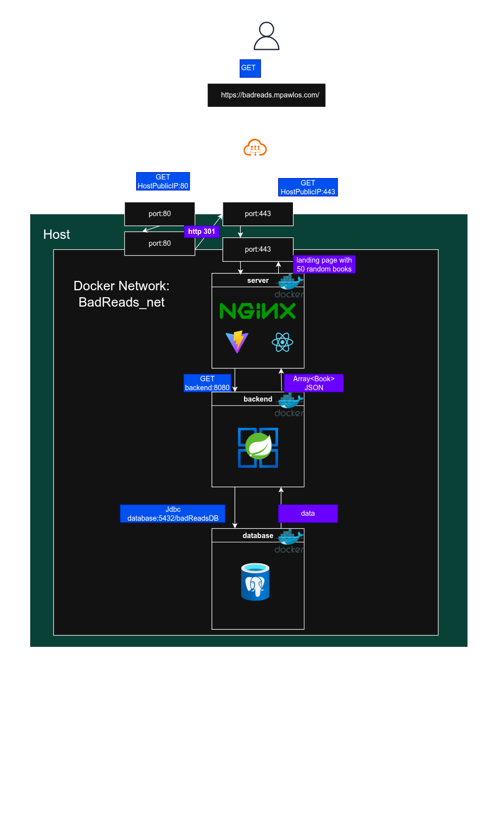

> [!info] See live on the web | github
> 
> **<a href="https://badreads.mpawlos.com" target="_blank">BadReads.com</a>** | <a href="https://github.com/Mxkyp/BadReads.git" target="_blank">on github</a>

## Overview
**BadReads** is a **self-hosted fullstack microservice** based book-rating app. \
<u>**GoodReads but better** (That's the plan).</u>

### Purpose
The purpose of this project is learning:
1. Kubernetes and Docker.
2. Self-hosting, administrator duties.
3. Developing great REST API's.
4. Web/System/container security.
5. Building fully functional web-services.
6. Infrastructure/IaC.
7. Making production grade SaaS products.
8. Scalable application architecture.

And provide a **easily reproducible, complete**  full-stack application. \
For others trying to learn how to build applications for the web.

## Version log

### v0.1.0

#### Features
1. Spring Boot REST api managing GET requests.
2. Postgres database.
3. vite + react frontend.
4. nginx web server and reverse proxy with traffic controls and security.
5. Docker compose with designated volumes, secrets etc

#### Architecture

#### Notes

As of right now I want to
1. Add POST handling to REST api(adding new users and them adding their books read)
2. Perform a project-wide refactoring (Docker images, frontend, backend tests)
3.
