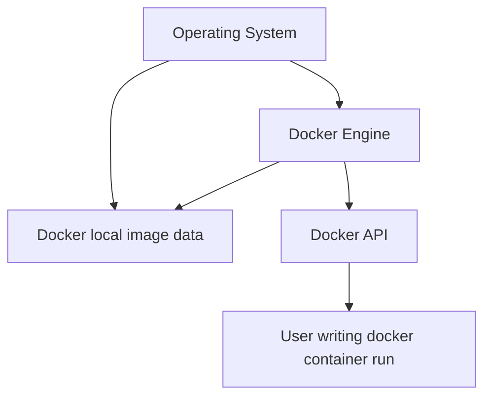

<!--Backlinks-->

<!--Backlinks-->

## Simply

## Basics

### Containers
1. Run only if any app inside is running. 
2. Deletion is manual.

### Images
1. Are build layer by layer, where layer is a single instruction: **ex. apt-get npm.**
2. Layers are cached, so when you build another image, it checks if it can use any of the cached layers.

### Architecture

## Useful commands

### Image creation(im)
(1) *docker image build --tag (NAME) (PATH TO DOCKERFILE)* - **builds an image from a Dockerfile found in the path dir, and assigns it the given name** \
(2) *docker container commit (CONTAINER NAME) (IMAGE NAME)* - **creates/overwrites an image based on the container, and assigns it the name** \

### Deletion (d)
(1) *docker container rm -f $((i.1))* - **removes all containers** \

### interaction (in)
(1) *docker container --interactive* - **connects to the container** \
(2) *docker container attach* - **attach to a container running in the background** \

### Inspection (i)
(1) *docker container ls -aq* - **Lists all containers id's** \
(2) *docker container ls -q* - **Lists running containers id's** \
(3) *docker container top* - **lists all processes inside the container** \
(4) *docker container inspect* - **list a wholle lotta details about the container** \
(4) *docker container stats* - **list cpu/memory/network usage of all running containers**
(5) *docker system - **administrive tasks**

### Publishing 
(1) *docker container run --publish 8088:80* - **maps the port host port 8088 to port 80 of the container, and allows outside access** \
(2) *docker container run --name (NAME) --env VAR=VALUE* - **assigns the NAME to the container, and sets the env variable to given value**

## Best practices

### Optimalization
1. In a Dockerfile, **instruction order matters**. \
Write instructions that are **not** bound to change **earlier**, and those that change more frequently later. \
Because if docker detects a change, it won't use cached values for the present or any further instructions.

